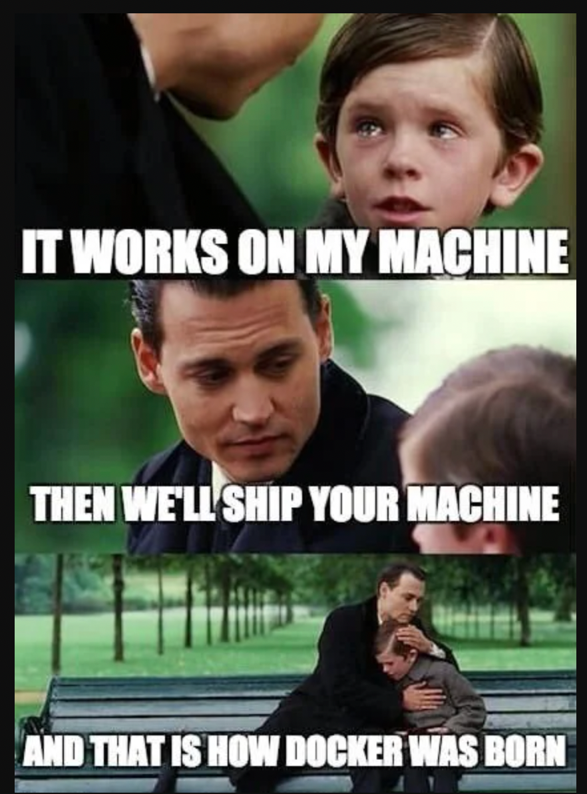

# Webapp Project

This project consists of a MongoDB database, a Node.js server, and a React UI. The MongoDB database is used to store user data, the Node.js server interacts with the database, and the React UI displays the data to users.

## Table of Contents

- [Project Overview](#project-overview)
- [Need of Docker](#need-of-docker)
- [Directory Structure](#directory-structure)
- [Getting Started](#getting-started)
- [Services](#services)
  - [MongoDB](#mongodb)
  - [Server](#server)
  - [UI Server](#ui-server)
- [Environment Variables](#environment-variables)
- [Docker Configuration](#docker-configuration)
  - [Dockerfile](#dockerfile)
  - [Docker Compose](#docker-compose)
- [Running the Project](#running-the-project)
- [Docker Concepts](#docker-concepts)
  - [Links](#links)
  - [Networks](#networks)
  - [Depends_on](#depends_on)
- [Authors](#authors)
- [License](#license)

## Project Overview

The project consists of three main components:
1. A MongoDB service to store user data.
2. A server built with Node.js and Express that connects to MongoDB, checks if the `User` collection is empty, and inserts data if no users are found.
3. A UI server built with React to visualize and interact with the data from the server.

## Need of Docker



Docker provides a solution to common problems in software development and deployment by ensuring consistency, portability, and efficiency. Let's understand this with a practical example.

Scenario: Developing a Web Application
Imagine you are developing a web application that consists of three main components:

- A backend server (Node.js)
- A frontend application (React)
- A database (MongoDB)

### Traditional Development and Deployment Challenges
#### - Environment Mismatch
Development Environment: The application works perfectly on your local machine, which runs Node.js 14, React 17, and MongoDB 4.4.
Production Environment: The production server runs Node.js 12, React 16, and MongoDB 4.2. These version differences cause the application to break in production.
#### - Dependency Management
Each component has its own set of dependencies. Managing these dependencies manually on different machines can be cumbersome and error-prone.
#### - Resource Overhead

Running multiple applications on the same server can lead to conflicts and inefficient resource utilization.
Deployment Complexity:

Deploying updates to the application requires ensuring all dependencies and configurations are correctly set up on the production server. This process is often manual and error-prone.
How Docker Solves These Challenges
Docker Containers encapsulate each component of the application along with its dependencies, ensuring consistent environments across development, testing, and production.

### How Docker Solves These Challenges
Docker Containers encapsulate each component of the application along with its dependencies, ensuring consistent environments across development, testing, and production.
Docker simplifies dependency management, resource utilization, and deployment processes, making it an essential tool for modern software development.

## Directory Structure

```
webapp/
├── data/
├── dummyServer/
│   ├── .idea/
│   ├── bin/
│   ├── models/
│   ├── node_modules/
│   ├── public/
│   ├── routes/
│   ├── views/
│   ├── .env
│   ├── app.js
│   ├── data.json
│   ├── Dockerfile
│   ├── package.json
│   └── package-lock.json
├── monsters-rolodex/
│   ├── .idea/
│   ├── node_modules/
│   ├── public/
│   ├── src/
│   ├── .gitignore
│   ├── .node-version
│   ├── Dockerfile
│   ├── package.json
│   ├── package-lock.json
│   └── README.md
├── .gitignore
├── .node-version
└── docker-compose.yml
```

## Getting Started

### Prerequisites

Ensure you have the following installed on your local machine:
- Docker
- Docker Compose

### Installation

Clone the repository:

```bash
git clone https://github.com/your-repo/project-name.git
cd project-name
```

## Services

### MongoDB

The MongoDB service is used to store user data. It is configured to run on port 27017 and uses a volume to persist data.

### Server

The server is built with Node.js and Express. It connects to the MongoDB service, checks the `User` collection, and inserts predefined data if the collection is empty. It runs on port 8080.

### UI Server

The UI server is built with React. It interacts with the server to display user data. It runs on port 3000.

## Environment Variables

The following environment variables are used in the project:

- `MONGODB_URL`: The URL to connect to the MongoDB database.
- `NODE_OPTIONS`: Node.js options for the UI server.
- `REACT_APP_SERVER_URL`: The URL of the server for the UI server to interact with.

## Docker Configuration

### Dockerfile

#### Server Dockerfile

Located in `dummyServer/Dockerfile`:

```dockerfile
FROM node:14

WORKDIR /app

COPY package.json ./
COPY load_data.js ./

RUN npm install

COPY . .

CMD ["node", "server.js"]
```

#### UI Server Dockerfile

Located in `monsters-rolodex/Dockerfile`:

```dockerfile
FROM node:14

WORKDIR /app

COPY package.json ./

RUN npm install

COPY . .

CMD ["npm", "start"]
```

### Docker Compose

The `docker-compose.yml` file defines the services and their configurations:

```yaml
version: '3.8'
networks:
  node-network:
    driver: bridge
services:
  mongodb:
    image: mongodb/mongodb-community-server
    ports:
      - "27017:27017"
    volumes:
      - ./data:/data/db
    restart: always
    networks:
      - node-network
    logging:
        driver: none

  server:
    build:
      context: ./dummyServer
      dockerfile: Dockerfile
    ports:
      - "8080:8080"
    links:
      - mongodb
    networks:
      - node-network
    depends_on:
      - mongodb
    environment:
      - MONGODB_URL=mongodb://mongodb:27017/mydatabase
      - PORT=8080

  ui_server:
    build:
      context: ./monsters-rolodex
      dockerfile: Dockerfile
    ports:
      - "3000:3000"
    environment:
      - NODE_OPTIONS=--openssl-legacy-provider
      - REACT_APP_SERVER_URL=http://localhost:8080
    restart: always
    links:
      - server
    networks:
      - node-network
    depends_on:
      - server
```

## Running the Project

1. Build and start the services using Docker Compose:

```bash
docker-compose up --build
```

2. Access the UI server at `http://localhost:3000`.

## Docker Concepts

### Links

The `links` option is used to create a link between containers. It allows one container to communicate with another container via a specified alias.

Example:
```yaml
links:
  - mongodb
```
This allows the `server` service to communicate with the `mongodb` service.

### Networks

The `networks` option defines a custom network for Docker containers. It allows containers to communicate with each other securely and efficiently.

Example:
```yaml
networks:
  node-network:
    driver: bridge
```
This creates a custom bridge network called `node-network` that all services will use.

### Depends_on

The `depends_on` option specifies the dependencies between services. It ensures that the dependent service starts only after the services it depends on have started.

Example:

```yaml
depends_on:
  - mongodb
```
This ensures that the `server` service starts only after the `mongodb` service has started.

## Authors

- Saurabh Ghatnekar (G23AI2077)
## License

This project is licensed under the MIT License.
